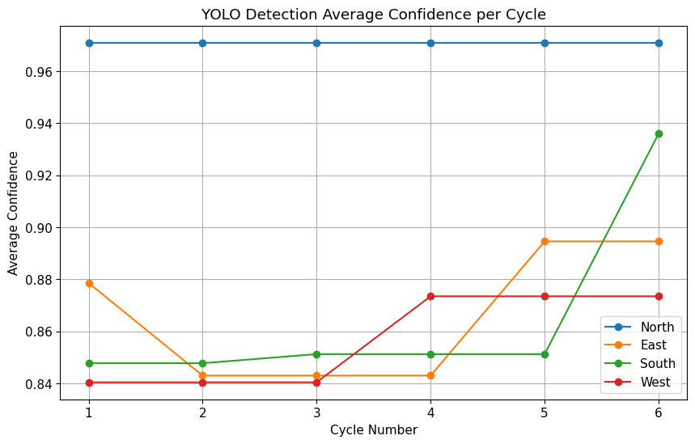
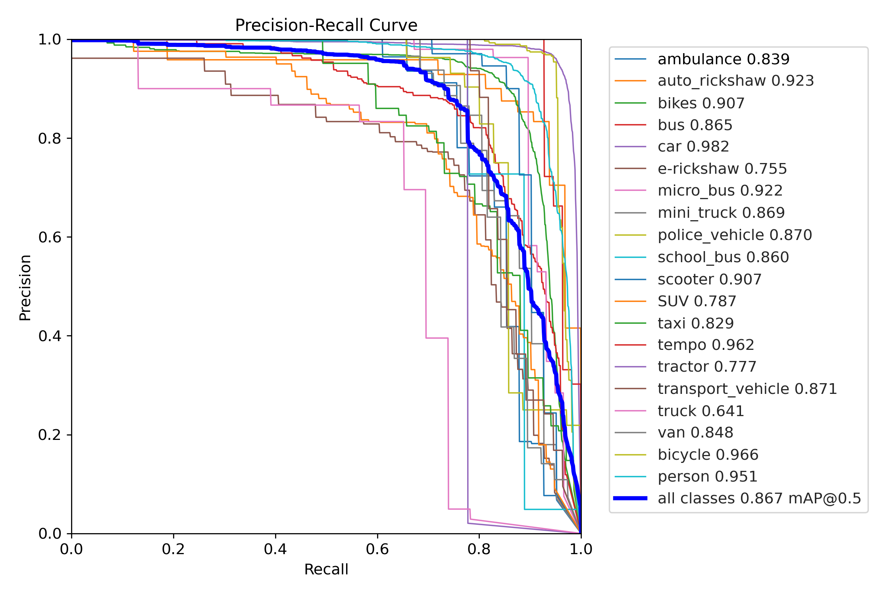

# 🚦 Intelligent Traffic Light Control for Diverse Vehicles Using Computer Vision
_**Real-Time Traffic Signal Optimization using YOLO Object Detection and Python.**_ 

A computer vision–based traffic management system that leverages YOLO object detection to monitor vehicle density and dynamically optimize signal timings at intersections.


## Table of Contents

- [Project Overview](#project-overview)
- [Key Features](#key-features)
- [Technologies Used](#technologies-used)
- [Installation](#installation)
- [Usage](#usage)
- [Outputs](#outputs)
- [Visualization](#visualization)
- [Future Work](#future-work)
- [License](#license)


## Project Overview
The **Intelligent Traffic Light Control System** dynamically manages a four-way intersection by analyzing real-time traffic images using computer vision.

The system uses YOLO-based object detection to identify and count different vehicle types, detect pedestrians, and recognize emergency vehicles. Based on this information, it automatically adjusts traffic signal durations to improve traffic flow, reduce congestion, and ensure fairness among all directions.

This system is designed specifically for **heterogeneous traffic environments** commonly found in Asian countries, where roads contain a mix of vehicles such as motorcycles, auto-rickshaws, buses, trucks, bicycles, and pedestrians.

By adapting signal timings dynamically, the system aims to:
- Improve traffic flow efficiency
- Reduce waiting times at intersections
- Prevent traffic starvation in low-priority directions
- Provide priority to emergency vehicles
This approach improves robustness under real-world traffic conditions.

The system determines:
- Which direction should receive the next green signal
- The optimal duration of the green signal
- When to prioritize emergency vehicles
- How to maintain fairness across lanes
The decision-making algorithm considers multiple factors:
- Vehicle counts per lane
- Detection confidence from the object detection model
- Starvation prevention logic
- Emergency vehicle detection
- Fair rotation among lanes
All signal decisions and traffic metrics are logged for further analysis, allowing insights into traffic behavior and system performance.

##  Key Features
- Vehicle Detection: Detects and counts multiple vehicle types using YOLO object detection.
- Dynamic Signal Timing: Green signal durations are adjusted dynamically based on detected traffic density.
- Starvation Prevention: Skip counters and fairness rotation ensure that no direction is ignored for extended periods.
- Emergency Vehicle Handling: Emergency vehicles such as ambulances and police vehicles are automatically prioritized.
- Data Logging and Visualization: The system logs traffic metrics and generates plots to analyze model confidence and system behavior.

## Technologies Used
- Python
- YOLO Object Detection
- OpenCV – image processing
- NumPy / Pandas – data handling
- Matplotlib – data visualization

## Installation
Clone the repository:
```bash
git clone https://github.com/Vartika1202/adaptive-traffic-computer-vision.git
cd adaptive-traffic-computer-vision
```
Install required dependencies:
``` bash
pip install -r requirements.txt
```

## Usage
- Place your trained YOLO model in the project directory.
- Ensure data.yaml contains your dataset configuration and class names.
- Run the traffic simulation:
``` bash 
python adaptive-traffic.py
```
- Generated outputs and plots will appear in the outputs/ directory.

## Outputs
### Simulation Output (Colab)
This log displays six cycles of an adaptive traffic signal simulation. It includes vehicle counts detected in each direction, signal timing decisions (green, yellow, red), fairness-based priority adjustments to prevent lane starvation, and emergency vehicle handling when applicable.

<p align="center">

</p>

### Object Detection Results
Output from the trained object detection model that locates and classifies different vehicle types in real-world traffic scenes using bounding boxes.

<p align="center">

</p>

## Visualization
### Traffic Simulation Log

<p align="center">

</p>

This table shows the adaptive traffic signal cycle log generated during the simulation.
Each cycle records:
- Vehicle counts from north, east, south, and west directions
- Selected green signal direction
- Signal timing durations (green, yellow, red)
- Emergency vehicle status
- Detection confidence for each direction
These logs help evaluate how the traffic controller adapts to changing traffic conditions.

### Model Performance (Average Detection Confidence)

<p align="center">

</p>

The average detection confidence across cycles remains high and stable, indicating reliable object detection performance.
This stability suggests that the model maintains strong detection quality even as traffic conditions change.

### Detection Quality Metrics (PR Curve)

<p align="center">

</p>

The Precision–Recall curve evaluates the balance between detection accuracy and detection coverage.
- Precision measures how many predicted objects are correct.
- Recall measures how many actual objects are detected.
A strong curve indicates effective detection performance across vehicle categories.

### Error Analysis (Confusion Matrix)

<p align="center">

</p>

The confusion matrix shows the classification performance across different vehicle categories.
Most classes exhibit strong accuracy, particularly:
- Cars
- Tempos
- Bicycles
- Auto-rickshaws
Some confusion occurs between visually similar categories such as:
- Trucks
- Mini-trucks
- Transport vehicles
Overall, the strong diagonal pattern indicates effective classification performance.

### Fairness and Traffic Control Behavior
The adaptive signal controller successfully prevents traffic starvation.
Key observations:
- No direction is permanently denied a green signal.
- All directions receive priority when traffic density increases.
- Fairness mechanisms ensure balanced traffic flow across the intersection.
This demonstrates how computer vision-based detection and adaptive signal control work together to optimize traffic management.

## Future Work
Possible improvements include:
- Traffic prediction using historical traffic data
- Live video feed support for continuous adaptive control.

## License
This project is licensed under the MIT License.
See the LICENSE file for more information.


