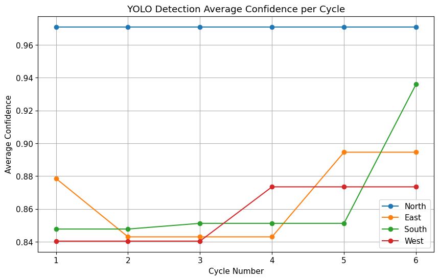
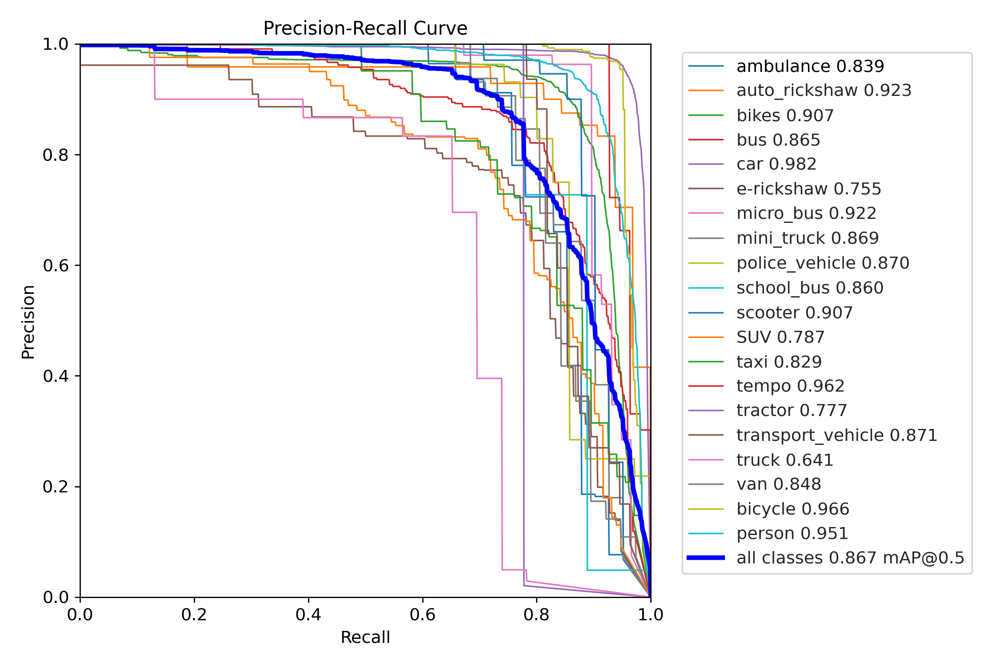

# 🚦 Intelligent Traffic Light Control for Diverse Vehicles Using Computer Vision

_**Real-Time Traffic Signal Optimization using YOLOv5 Object Detection and Python.**_

A computer vision–based traffic management system that uses a custom-trained YOLOv5 model to monitor vehicle density across a four-way intersection and dynamically adjust traffic signal durations through an interactive web dashboard.


---

## Table of Contents

- [Project Overview](#project-overview)
- [Key Features](#key-features)
- [System Architecture](#system-architecture)
- [Technologies Used](#technologies-used)
- [Installation](#installation)
- [Usage](#usage)
- [Outputs](#outputs)
- [Visualization](#visualization)
- [Future Work](#future-work)
- [License](#license)

---

## Project Overview

The **Intelligent Traffic Light Control System** dynamically manages a four-way intersection by analyzing uploaded CCTV footage using computer vision. Each of the four lanes — North, East, South, and West — can accept either a video clip or a still image captured from a traffic camera.

The system uses a custom YOLOv5 model trained on heterogeneous traffic data to detect and count vehicle types including **motorcycles, cars, buses, and trucks**. Based on the detected vehicle density in each lane, it computes an adaptive green-light duration and determines which lane should receive priority.

This system is designed for the **heterogeneous traffic environments** commonly found in Asian countries, where roads contain a diverse mix of vehicle types that differ significantly in size and road impact.

By adapting signal timings dynamically, the system aims to:
- Improve overall intersection throughput
- Reduce average waiting times per lane
- Prevent traffic starvation in low-volume directions
- Provide a data-driven basis for signal control decisions

All detection results, vehicle counts, density scores, and signal decisions are stored in a MySQL database and displayed in the web dashboard for review and analysis.

---

## Key Features

| Feature | Description |
|---|---|
| **Multi-Vehicle Detection** | Detects motorcycles, cars, buses, and trucks using a custom YOLOv5 model |
| **IoU Object Tracking** | 2-stage tracker (IoU + centroid fallback) with confirmation gate to prevent double-counting |
| **Adaptive Signal Timing** | Green-light duration (10–60 s) is calculated from weighted vehicle density per lane |
| **4-Lane Dashboard** | Web interface to upload videos/images for all four intersection directions simultaneously |
| **Cross-Class NMS** | Deduplication of overlapping detections across different vehicle classes before tracking |
| **Database Logging** | All results are persisted to MySQL for historical analysis |
| **Processed Video Output** | Annotated output video with bounding boxes, track IDs, and live HUD counter |

---

## System Architecture

```
┌─────────────────────────────────────────────┐
│              Web Dashboard (Flask)           │
│   Upload video/image per lane direction      │
└────────────────────┬────────────────────────┘
                     │
         ┌───────────▼────────────┐
         │   YOLOv5 Inference     │
         │  (Custom Traffic Model)│
         └───────────┬────────────┘
                     │
         ┌───────────▼────────────┐
         │   SimpleTracker        │
         │  IoU → Centroid → Gate │
         │  (no double-counting)  │
         └───────────┬────────────┘
                     │
     ┌───────────────▼───────────────┐
     │   Density & Signal Timing     │
     │   Weighted score → Duration   │
     │   (motor×1, car×2, bus/truck×3)│
     └───────────────┬───────────────┘
                     │
         ┌───────────▼────────────┐
         │   MySQL + Dashboard    │
         │   Results & Analytics  │
         └────────────────────────┘
```

**Green duration thresholds:**

| Weighted Density | Green Duration |
|:---:|:---:|
| ≥ 40 | 60 seconds |
| ≥ 25 | 45 seconds |
| ≥ 12 | 30 seconds |
| > 0 | 20 seconds |
| 0 | 10 seconds |

---

## Technologies Used

| Technology | Purpose |
|---|---|
| **Python 3.10+** | Core language |
| **YOLOv5** | Custom-trained vehicle detection model |
| **OpenCV** | Video capture, frame processing, annotation |
| **Flask** | Web dashboard and REST API |
| **MySQL** | Traffic log storage |
| **NumPy / Pandas** | Numerical computation and data handling |
| **Matplotlib** | Visualization and performance plots |
| **PyTorch** | Model inference backend |

---

## Project Structure

```
PBL-SMART-TRAFFIC-LIGHT/
│
├── app.py                        # Flask app — main entry point
├── adaptive-traffic.py           # Standalone simulation script (console)
├── requirements.txt              # Python dependencies
├── run.bat                       # Windows one-click launcher
├── data.yaml                     # Dataset class configuration
├── README.md
│
├── models/                       # YOLO model weights (not tracked by git)
│   └── best_traffic_vehicle_yolov5.pt   # ← place your model here
│
├── uploads/                      # Uploaded CCTV videos/images (auto-created)
│
├── processed/                    # Annotated output videos (auto-created)
│
├── templates/                    # Flask HTML templates
│   ├── index.html                # Main dashboard
│   └── login.html                # Login page
│
├── static/                       # CSS, JS assets
│   ├── css/
│   └── js/
│
├── outputs/                      # Detection result images
│   ├── val_batch2_pred.png
│   └── colab_output.png
│
└── plots/                        # Performance visualization charts
    ├── PR_curve.png
    ├── average_confidence.png
    ├── confusion_matrix.png
    └── cycle_log.png
```

> **Note:** The `models/`, `uploads/`, and `processed/` directories are tracked in git (via `.gitkeep`) but their contents are ignored. After cloning, download your model weights and place them in `models/` before running the app.

---

## Installation

### 1. Clone the repository

```bash
git clone https://github.com/YOUR_USERNAME/YOUR_REPO_NAME.git
cd YOUR_REPO_NAME
```

### 2. Create and activate a virtual environment

```bash
python -m venv venv

# Windows
venv\Scripts\activate

# macOS / Linux
source venv/bin/activate
```

### 3. Install dependencies

```bash
pip install -r requirements.txt
```

### 4. Set up the database

Import the provided SQL schema into MySQL:

```bash
mysql -u root -p traffic_system < schema.sql
```

### 5. Place your model

Put your trained YOLOv5 `.pt` file inside the `models/` directory:

```
models/
└── best_traffic_vehicle_yolov5.pt
```

---

## Usage

### Running the Web Dashboard

```bash
python app.py
```

Open your browser and navigate to **http://127.0.0.1:5000**.

**Dashboard workflow:**
1. Log in with your credentials.
2. Upload a CCTV video or image for each lane direction (North / East / South / West).
3. Click **Process** — the system runs detection, tracking, and density analysis.
4. View annotated output video, vehicle counts, density scores, and the recommended green-light duration per lane.
5. The intersection overview panel shows which lane currently holds the green signal.

### Running the Simulation Script (Console)

```bash
python adaptive-traffic.py
```

Generated outputs and plots will appear in the `outputs/` directory.

---

## Outputs

### Object Detection Results

The custom YOLOv5 model detects and classifies multiple vehicle types in real-world CCTV footage, drawing persistent bounding boxes with track IDs and confidence scores.

<p align="center">

</p>

### Simulation Output

Six-cycle adaptive traffic signal simulation log showing vehicle counts, signal decisions, density scores, and timing per direction.

<p align="center">

</p>

---

## Visualization

### Traffic Simulation Log

<p align="center">

</p>

Each cycle records vehicle counts per direction, the selected green-signal lane, signal timing durations, and detection confidence. These logs evaluate how the controller adapts to changing traffic conditions over time.

### Average Detection Confidence

<p align="center">

</p>

Average confidence remains high and stable across cycles, indicating consistent detection quality regardless of varying traffic density.

### Precision–Recall Curve

<p align="center">

</p>

The PR curve evaluates detection quality across all vehicle categories. A strong curve toward the top-right corner confirms the model achieves high precision and recall simultaneously.

### Confusion Matrix

<p align="center">

</p>

The confusion matrix shows per-class classification accuracy. Most vehicle categories are correctly identified. Minor confusion occurs between visually similar classes such as trucks, mini-trucks, and transport vehicles — expected given their similar overhead silhouettes in CCTV footage.

---

## Future Work

- **Live video stream support** — process real-time RTSP/webcam feeds instead of uploaded clips
- **Traffic prediction** — incorporate historical density data to anticipate congestion before it occurs
- **Emergency vehicle priority** — detect ambulances and fire trucks and grant immediate green override
- **Pedestrian detection** — extend the model to account for pedestrian crossing demand
- **Multi-camera synchronization** — coordinate signal decisions across adjacent intersections

---

## License

This project is licensed under the **MIT License**.  
See the [LICENSE](LICENSE) file for details.
